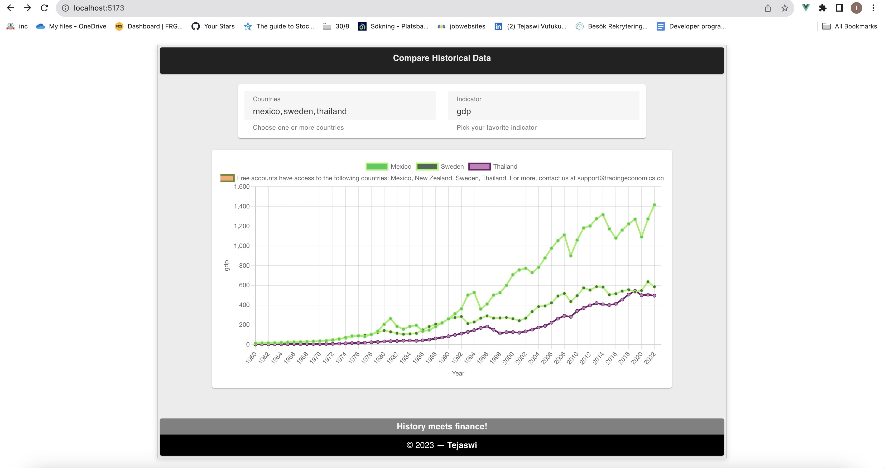
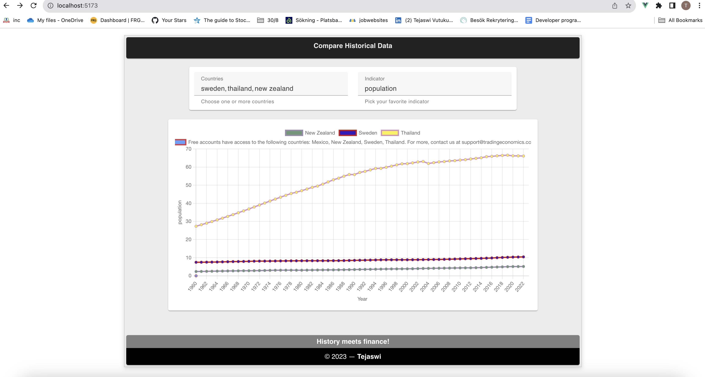
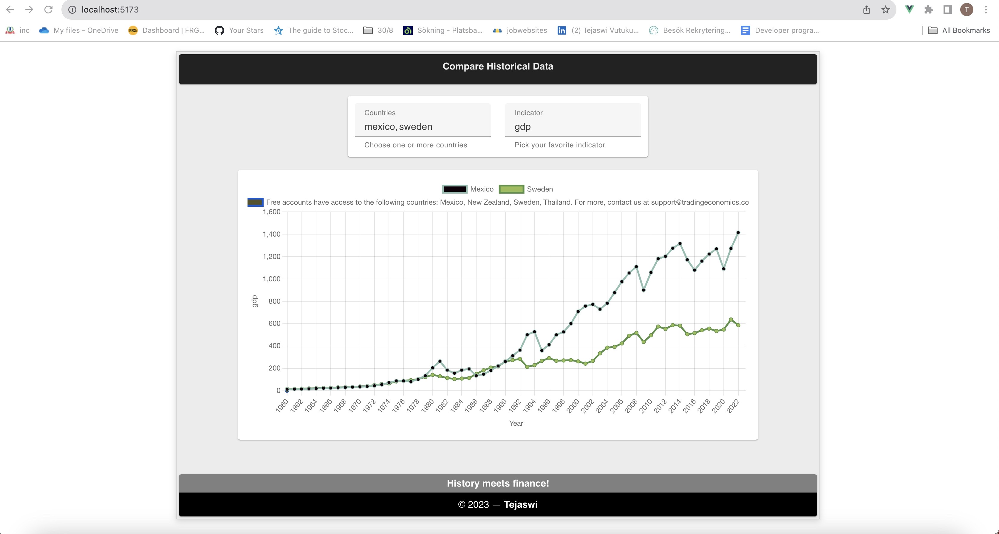

# Compare Historical Economic Indicators App

## Overview

The Historical Economic Indicators App is a web application that allows users to view and compare historical data for countries against a particular economic indicator, such as *GDP* or *population*. It leverages the **_Historical_** API in the Trading Economics's **_Indicators_** APIs, which provides access to a wealth of economic data.

This app is built using the latest technologies, including Vue 3, Vuetify, and Vite, to provide a modern and responsive user experience.

## Features

- View historical data for various economic indicators.
- Select one or more countries to analyze against an indicator.
- Visualize historical data in graphical charts for easy analysis.
- User-friendly interface with a clean and intuitive design. Check the demo section below for more amazing content.



## Getting Started

Follow these instructions to get the app up and running on your local development environment.

### Prerequisites

Make sure you have the following software installed on your system:

- Node.js (https://nodejs.org/)
- npm (Node Package Manager)

### Installation

1. Clone the repository to your local machine:

   ```bash
   git clone https://github.com/tejav27/compare-economic-indicators.git
   ```

2. Change into the project directory:

   ```bash
   cd compare-economic-indicators
   ```

3. Install the project dependencies:

   ```bash
   npm install
   ```
4. Compile and Hot-Reload for Development

   ```sh
   npm run dev
   ```

### Configuration

You'll need to obtain an API key from the Trading Economics API (https://docs.tradingeconomics.com/indicators/historical/) to access historical data. Once you have your API key, create a `.env` file in the project root directory and add the following:

```dotenv
VITE_API_KEY=YOUR_API_KEY
```

Replace `YOUR_API_KEY` with your actual API key.

### Running the App

Start the development server with hot-reloading by running the following command:

```bash
npm run dev
```

This will usually start the app on `http://localhost:5173`.

## Usage

1. Open the app in your web browser at `http://localhost:5173`.
2. Use the intuitive user interface to select countries and an indicator to compare against.
3. Enjoy the immersive charts depicting the historical data in a graphical form and analyze the economic trends.

## Demo
### Web App Demo

Click [this link](https://drive.google.com/file/d/1_Ltk-_7Ht74JLR6LFkEQpY7i05nqgpJZ/view?usp=drive_link) to watch a **_demo video_** showcasing the features of the Historical Data Charts Web App.



